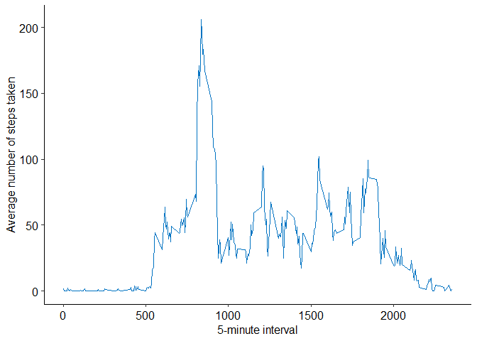
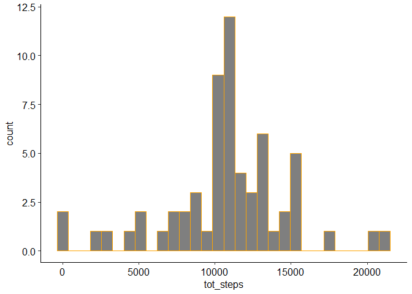
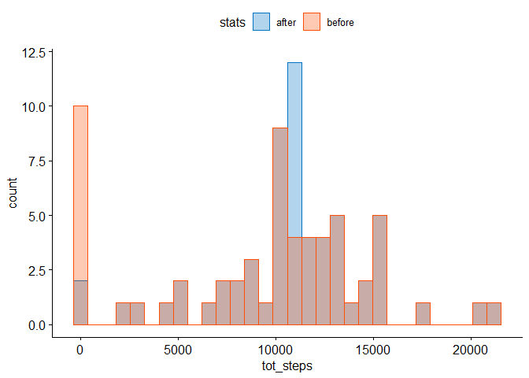
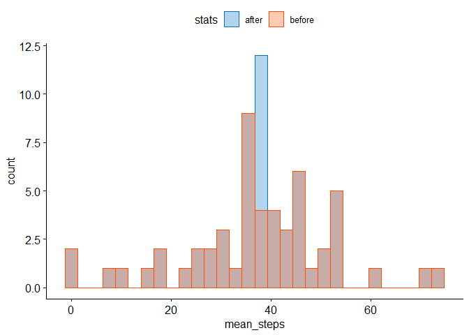
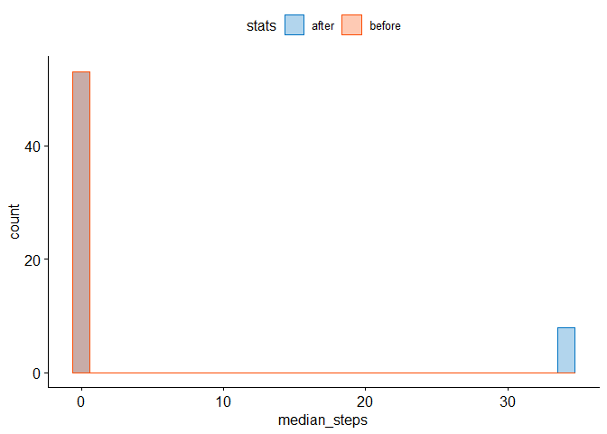
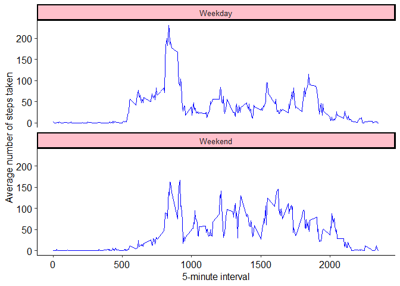

# Project Overview

This assessment, as part of the Coursera - Reproducible Research course,  makes use of data from a personal activity monitoring device. This device collects data at 5 minute intervals throughout the day. The data consists of two months of data from an anonymous individual collected during the months of October and November 2012, and includes the number of steps taken in 5 minute intervals each day. 

**This analysis answers the following questions, after reading in the data** 

* What is mean total number of steps taken per day (before and after NA values are imputed? Do these values differ from the estimates from the first part of the assignment (when NA values were ignored? What is the impact of imputing missing data on the estimates of the total daily number of steps?  
* What is the average daily activity pattern? 
* Are there differences in activity patterns between weekdays and weekends? 


## Loading and preprocessing the data


```r
## Unzip the dataset
unzip(zipfile = "activity.zip", exdir = "./data")
```


```r
## List files in the data directory
list.files("./data")
```

```
## [1] "activity.csv"
```


```r
## Read the file
activity_data <- read.csv("./data/activity.csv")
```


```r
## Convert date from character to date format
activity_data$date  <- as.Date(as.character(activity_data$date), format = "%Y-%m-%d")
```

## What is mean total number of steps taken per day?

### Show the total, mean & meadian steps per day (NA values ignored)

```r
Activity_Summary <- activity_data %>%
        group_by(date) %>%
        summarize(tot_steps = sum(steps, na.rm = TRUE),
                  mean_steps = mean(steps,na.rm = TRUE),
                  median_steps = median(steps,na.rm = TRUE)
                  )
## Show new summary data
head(Activity_Summary)
```

```
## # A tibble: 6 x 4
##   date       tot_steps mean_steps median_steps
##   <date>         <int>      <dbl>        <dbl>
## 1 2012-10-01         0    NaN               NA
## 2 2012-10-02       126      0.438            0
## 3 2012-10-03     11352     39.4              0
## 4 2012-10-04     12116     42.1              0
## 5 2012-10-05     13294     46.2              0
## 6 2012-10-06     15420     53.5              0
```
### Create a Histogram of the total number of steps taken each day (NA Values ignored)


```r
ggplot(Activity_Summary, aes(x = tot_steps)) +
        geom_histogram(bins = 30, color = "orange", fill = "black", 
                       alpha = 0.5,position = "identity")
```

<!-- -->

### Show the mean and median total steps for each day (NA values ignored)

```r
## Show mean
mean(Activity_Summary$tot_steps)
```

```
## [1] 9354.23
```

```r
## Show median
median(Activity_Summary$tot_steps)
```

```
## [1] 10395
```


## What is the average daily activity pattern?


###get the mean interval number of steps for each interval

```r
mean_interval <- activity_data %>%
        group_by(interval) %>%
        summarize(mean_steps_interval = mean(steps, na.rm = TRUE)
        )
```
### plot a time series series plot of the 5-minute interval (x-axis) and the average number of steps taken, averaged across all weekday days or weekend days (y-axis).


```r
ggplot(data = mean_interval  , aes(x = interval, y = mean_steps_interval))+
        geom_line(color = "#0073C2FF", size = 0.5) + 
        xlab("5-minute interval") + 
        ylab("Average number of steps taken")
```

<!-- -->


## Which 5-minute interval, on average across all the days in the dataset, contains the maximum number of steps?


```r
max_interval <- activity_data %>%
        group_by(interval) %>%
        summarize(sum_steps = sum(steps, na.rm = TRUE))

## Show interval with the most steps
max_interval[which.max(max_interval$sum_steps), ]
```

```
## # A tibble: 1 x 2
##   interval sum_steps
##      <int>     <int>
## 1      835     10927
```


## Imputing missing values

### Counting NA values in the steps and interval variables. 

```r
na_steps <-  activity_data[is.na(activity_data$steps),1]

## Count of NA steps
length(na_steps)
```

```
## [1] 2304
```


```r
na_interval <-  activity_data[is.na(activity_data$interval),3]

## Count of NA intervals
length(na_interval)
```

```
## [1] 0
```

### Create a copy of the activity data that will have the NA values imputed

```r
temp_activity <- activity_data
```


```r
## Merge the mean_interval data with the activity data
temp_activity2 <- merge(temp_activity, mean_interval,by = c("interval"))
```


```r
## View the aggregated data before imputing NA (note:NA value in steps line 1)
head(temp_activity2)
```

```
##   interval steps       date mean_steps_interval
## 1        0    NA 2012-10-01            1.716981
## 2        0     0 2012-11-23            1.716981
## 3        0     0 2012-10-28            1.716981
## 4        0     0 2012-11-06            1.716981
## 5        0     0 2012-11-24            1.716981
## 6        0     0 2012-11-15            1.716981
```


```r
## Replace the NaN values that were created for intervals that 
## had no mean for the day
temp_activity2$mean_steps_interval <-replace(temp_activity2$mean_steps_interval,                              is.na(temp_activity2$mean_steps_interval), 0)
```


```r
## Replace NA step values with mean interval value

no_na_activity <- temp_activity2 %>% mutate_at(vars(steps),~ifelse(is.na(.x),                                           temp_activity2$mean_steps_interval,.x))

## Show that NA value are replaced (new value in steps line 1)
head(no_na_activity)
```

```
##   interval    steps       date mean_steps_interval
## 1        0 1.716981 2012-10-01            1.716981
## 2        0 0.000000 2012-11-23            1.716981
## 3        0 0.000000 2012-10-28            1.716981
## 4        0 0.000000 2012-11-06            1.716981
## 5        0 0.000000 2012-11-24            1.716981
## 6        0 0.000000 2012-11-15            1.716981
```


```r
## Creat a new active summary table for creating plots after NAs being replaced with the mean steps per interval data
Activity_Summary2 <- no_na_activity %>%
        group_by(date) %>%
        summarize(tot_steps = sum(steps),
                  mean_steps = mean(steps),
                  median_steps = median(steps)
        )

## Show new summary data with no NA values
head(Activity_Summary2)
```

```
## # A tibble: 6 x 4
##   date       tot_steps mean_steps median_steps
##   <date>         <dbl>      <dbl>        <dbl>
## 1 2012-10-01    10766.     37.4           34.1
## 2 2012-10-02      126       0.438          0  
## 3 2012-10-03    11352      39.4            0  
## 4 2012-10-04    12116      42.1            0  
## 5 2012-10-05    13294      46.2            0  
## 6 2012-10-06    15420      53.5            0
```


### Create a Histogram of the total number of steps taken each day (NA values replaced)

```r
ggplot(Activity_Summary2, aes(x = tot_steps)) +
        geom_histogram(bins = 30, color = "orange", fill = "black", 
                       alpha = 0.5,position = "identity")     
```

<!-- -->

# Do these values differ from the estimates from the first part of the assignment? 

### Show the difference between mean & median total steps before and after NA values imputed)

```r
## Show mean differences
mean_after <- mean(Activity_Summary2$tot_steps)
mean_before <- mean(Activity_Summary$tot_steps)
mean_change <- (mean_after - mean_before)

mean_after
```

```
## [1] 10766.19
```

```r
mean_before
```

```
## [1] 9354.23
```

```r
mean_change
```

```
## [1] 1411.959
```

```r
## Show median differences
median_after <- median(Activity_Summary2$tot_steps)
median_before <- median(Activity_Summary$tot_steps)
median_change <- (median_after - median_before)

median_after
```

```
## [1] 10766.19
```

```r
median_before
```

```
## [1] 10395
```

```r
median_change
```

```
## [1] 371.1887
```
# What is the impact of imputing missing data on the estimates of the total daily number of steps?

## Using histogram of the new summary data to show impact of the differences

```r
## Set up before and after variable
Activity_Summary$stats <- c("before")
Activity_Summary2$stats <- c("after")
before_after_summary <- rbind(Activity_Summary, Activity_Summary2)
## Plot the tot_steps differences
gghistogram(before_after_summary, x = "tot_steps",
               bins = 30,
               color = "stats",
               fill = "stats",
               alpha = 0.3,
               position = "identity",
               palette = c("#0073C2FF", "#FC4E07"))
```

<!-- -->

```r
## Plot the mean_steps differences
gghistogram(before_after_summary, x = "mean_steps",
               bins = 30,
               color = "stats",
               fill = "stats",
               alpha = 0.3,
               position = "identity",
               palette = c("#0073C2FF", "#FC4E07"))
```

<!-- -->

```r
## Plot the mediansteps differences
gghistogram(before_after_summary, x = "median_steps",
               bins = 30,
               color = "stats",
               fill = "stats",
               alpha = 0.3,
               position = "identity",
               palette = c("#0073C2FF", "#FC4E07"))
```

<!-- -->

## Are there differences in activity patterns between weekdays and weekends?


```r
## Add a day type varable to the activity data (NA values imputed)
no_na_activity$day <- wday(no_na_activity$date, label = TRUE)
no_na_activity$day_type <- 
        ifelse(no_na_activity$day %in% c("Sat","Sun"),"Weekend","Weekday")

## Aggregate the data
mean_interval2 <- no_na_activity %>%
        group_by(interval,day_type) %>%
        summarize(mean_steps_interval = mean(steps, na.rm = TRUE)
        )


## Create a plot to show the diference between weekend and weekday activity
p <- ggplot(data = mean_interval2  , aes(x = interval, y = mean_steps_interval))+
        geom_line(color = "blue", size = 0.5) + 
        xlab("5-minute interval") + 
        ylab("Average number of steps taken")
p + facet_wrap(day_type ~., ncol = 1) + 
        theme(strip.background = element_rect(
                color="black",
                fill= "pink",
                size=1.5, 
                linetype="solid"))
```

<!-- -->
